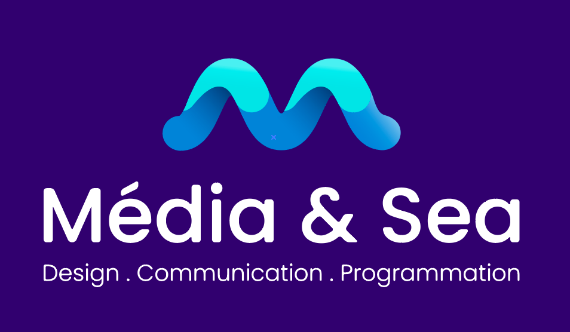

# Descriptif du projet

**Porteur de projet :**

**Sujet :** *Aller à la mer*

**Nom d'équipe :** *Média & Sea*

### Participants : 

- *Sciencescom* :
  - Yassamine Tekin
  - Emma Barbier

- *AGR* :
  - Mathilde Petit
  - Camille Picquet
  - Mathilde Guerois

- *Polytech* :
  - Titouan Guyader
  - Tom Gobardhan
  - Nolwenn Laporte-Bidet
  - Estéban Jamin
  - Armand Boutier
  - Julien Pinçon
  - Théo Daudin

# Documentation

## Comment lancer le projet

Il faut d'abord télécharger le projet par clonage ou par ZIP. 
Il vous ait nécessaire d'avoir une version récente de NodeJS <code>12.X +</code> puis,
en passant par la racine, tapez : 

    npm install
    npm start

ou bien en passant par le dossier 'mer-a', décommentez la ligne <code>// app.listen(8080);</code> 
et commentez <code>module.exports = app;</code> à la fin du ficher 'server.js' puis, tapez les commandes : 

    npm install
    npm start

Le site web sera disponible à l'adresse <code>localhost:8080</code> équivalent à <code>127.0.0.1:8080</code>.

## Comment utiliser l'API

### Les routes

<code>/api/all/regions</code> : *Retourne les zones existantes et leur identifiant*  
<code>/api/all/types</code> : *Retourne les types existants et leur identifiant*  
<code>/api/:region_id/:type_id</code> : *Retourne les légendes pour la zone <code>region_id</code> et le type <code>type_id</code>*  

## Accès

Vous pouvez accéder à l'API en utilisant directement les routes, mais des fonctions de récupérations sont mises à disposition
dans le fichier 'public/js/dbConnection.js'. 
Ce fichier met à dispositions 3 fonctions asynchrones pour utiliser les routes de l'API, 

- Pour récupérer les légendes :

        async function getLegendes(region, type, callback)

  - <code>region</code> : *l'identifiant de la région*
  - <code>type</code> : *l'identifiant du type de légende*
  - <code>callback</code> : *fonction permettant de traiter le résultat de la requête (prend le résultat en paramètre)*
  - <code>@return</code> : *retourne une promesse ([JS Promise](https://developer.mozilla.org/en-US/docs/Web/JavaScript/Reference/Global_Objects/Promise))*
  - <code>@query_result</code> : *tableau de légendes <code>[Legende{}, ...]</code> (voir plus [Legende](server/classes/Legende.js))*

  et une fonction asynchrone utilitaire pour récupérer les données de n'importe quelle URL.

- Pour récupérer les régions :

        async function getRegionsId(callback)

  - <code>callback</code> : *fonction permettant de traiter le résultat de la requête (prend le résultat en paramètre)*
  - <code>@return</code> : *retourne une promesse ([JS Promise](https://developer.mozilla.org/en-US/docs/Web/JavaScript/Reference/Global_Objects/Promise))*
  - <code>@query_result</code> : *tableau d'objets <code>[{'id': &lt;int&gt;, 'nomDepartement': &lt;string&gt;}, ...]</code>*

- Pour récupérer les types :

        async function getTypesId(callback)

  - <code>callback</code> : *fonction permettant de traiter le résultat de la requête (prend le résultat en paramètre)*
  - <code>@return</code> : *retourne une promesse ([JS Promise](https://developer.mozilla.org/en-US/docs/Web/JavaScript/Reference/Global_Objects/Promise))*
  - <code>@query_result</code> : *tableau d'objets <code>[{'id': &lt;int&gt;, 'nomCategorie': &lt;string&gt;}, ...]</code>*

## Code documentation